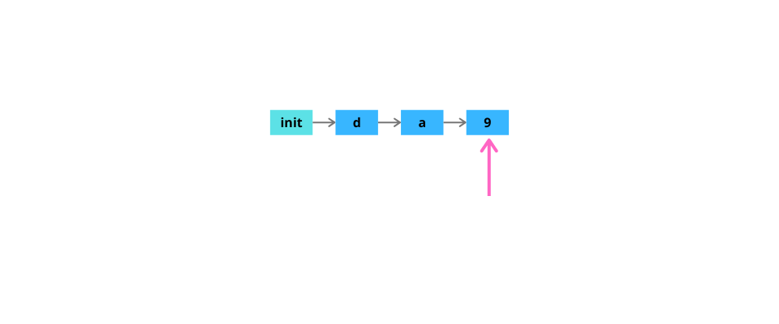
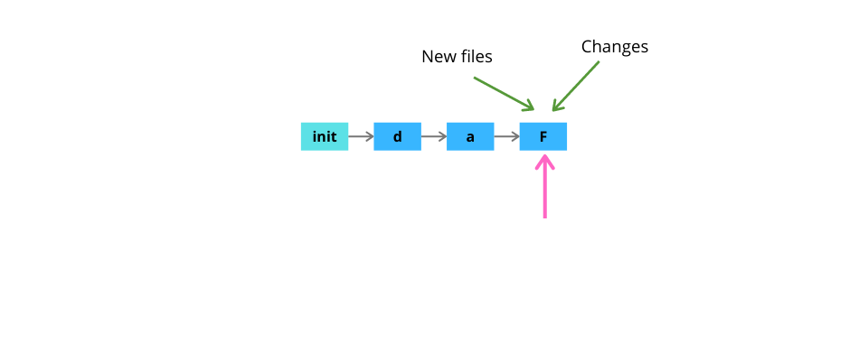
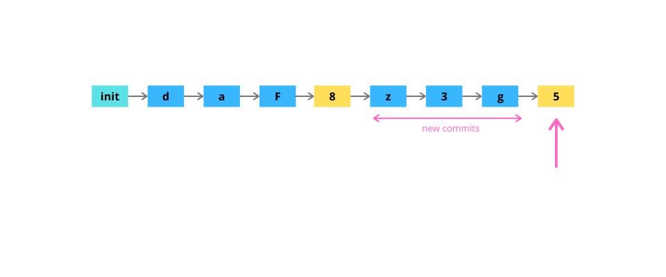
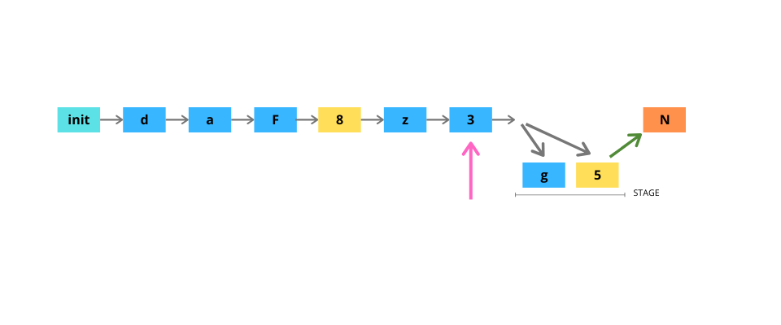
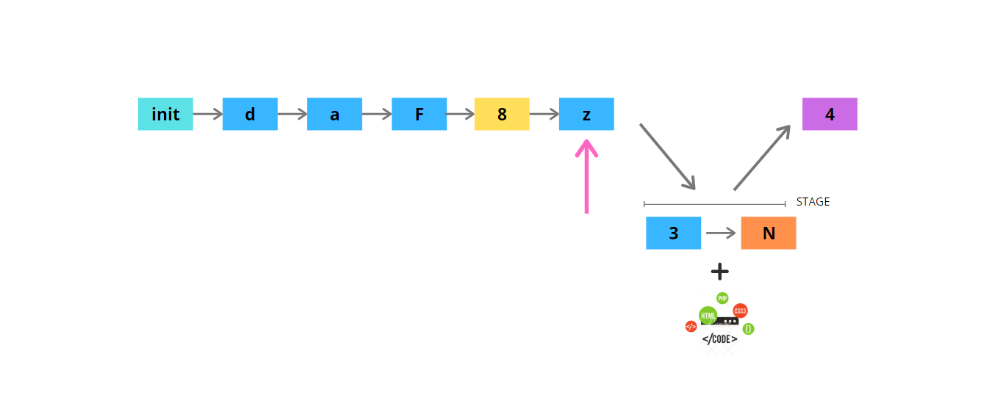
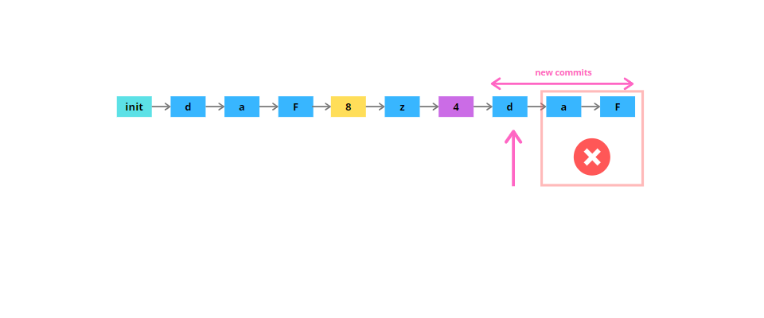
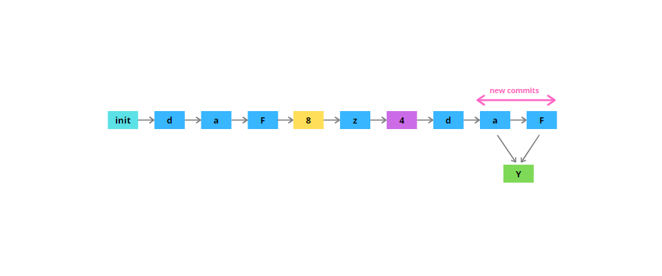
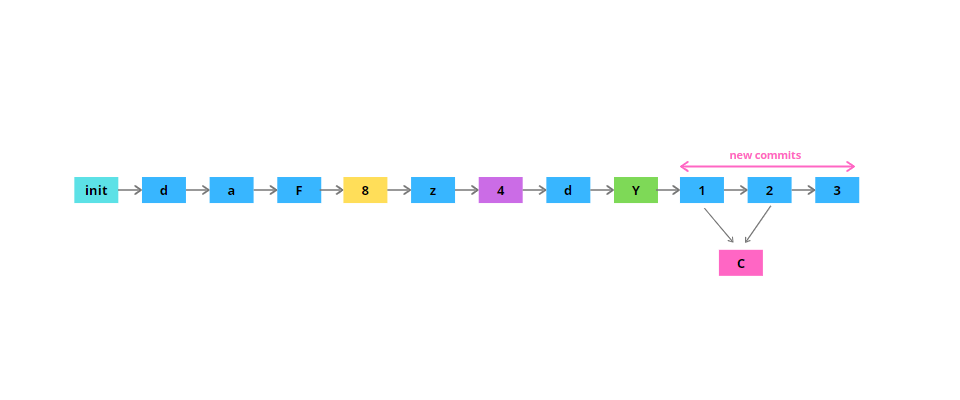
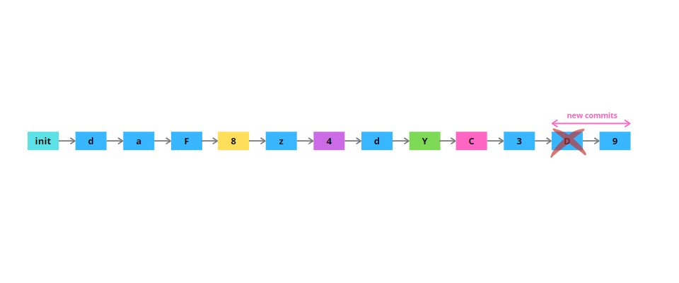

1. Create git repo. Make a few commits. Next, change the commit message of last commit.

2. Modify files or/add new files. Amend the changes to the last commit.

3. Create new commit. Then create 3 more new commits. Revert the last 3 commits. In case of conflicts resolve them.

4. Move index to point to 2 commits before current and move the changes of those commits to working directory, making them not staged. Next commit the changes.

5. Move index to point 2 commits before current making the changes after that commit moved to stage. Add more changes to stage and perform a commit.

6. Create 3 new commits. Move index 2 commits before current and erase the changes after that commit.

7. Stop tracking a file from repo. Delete the file using git clean.

8. Create 2 commits that are related to same functionality. Then squash the commits. If necessary change the commit message of the new combined commit.

9. Create 3 commits. The first 2 should be related to same functionality. The third should not be related to previous two. Squash the 2 commits that are just behind the third. Instead of `HEAD` use `SHA` of second commit. If necessary change the commit message of the new combined commit.

10. Create 2 commits. Drop the first one.

